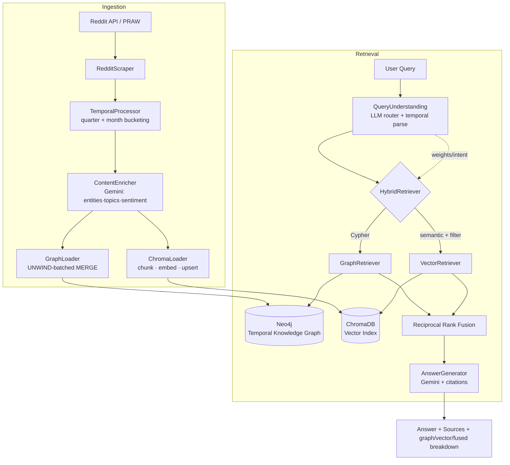
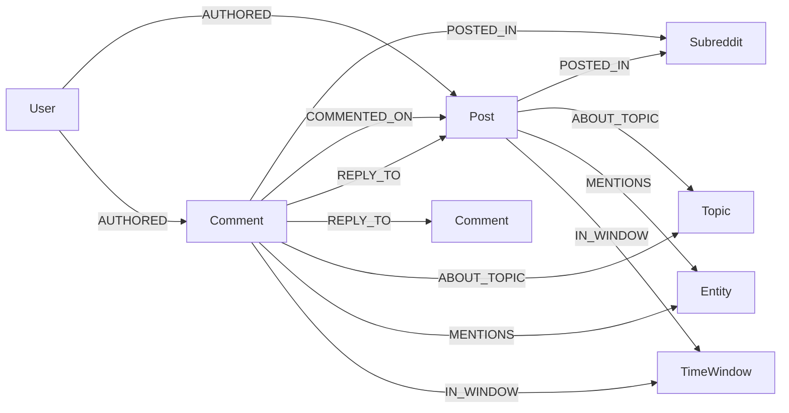
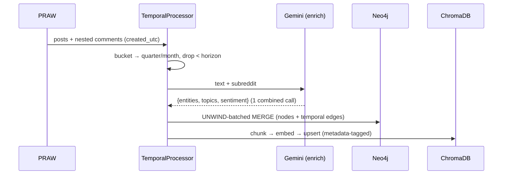
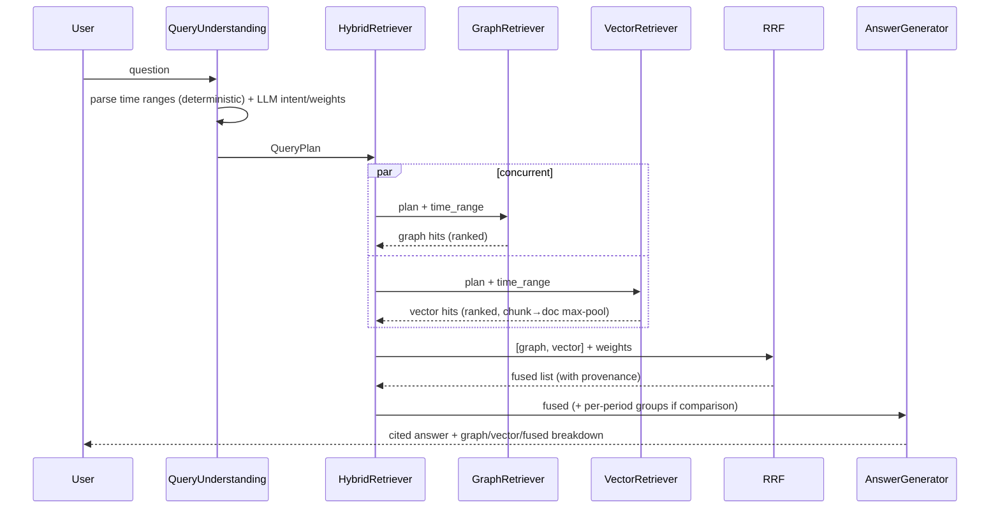

# Hybrid GraphRAG for Time-Series Reddit Intelligence

A production-style system that ingests Reddit discussions, structures them as a
**temporal knowledge graph** (Neo4j) *and* a **vector index** (ChromaDB) in
parallel, then answers time-aware questions using **hybrid retrieval** —
fusing graph traversal and semantic search with **Reciprocal Rank Fusion
(RRF)** and synthesising cited answers with **Gemini 2.5 Flash**.

> Built for the Jupiter Meta Labs GenAI Backend assignment. Every stack choice
> is justified below; the goal was strong engineering, not brand loyalty.

---

## 1. What it does

Given a natural-language question, the system:

1. **Understands** the query (intent, topics/entities, time references, which
   retriever to favour) using an LLM router + a deterministic temporal parser.
2. **Retrieves** from two stores *concurrently*:
   - **Graph** — multi-hop Cypher traversals (author influence, community
     leadership, topic/entity matches), all time-filtered.
   - **Vector** — semantic similarity over chunk embeddings with time/subreddit
     metadata pushed *into* the index.
3. **Fuses** the two ranked lists with **RRF** (rank-based, so the two stores'
   incomparable scores don't need normalising).
4. **Synthesises** a cited answer with Gemini, and for two-period questions
   produces a true **side-by-side temporal comparison**.

Four canonical query types are demonstrated end-to-end in `demo.py`:

| # | Type | Example |
|---|------|---------|
| 1 | Vector-dominant (semantic) | *"What are people saying about running LLMs locally?"* |
| 2 | Graph-dominant (traversal) | *"Who are the most influential voices on open-source LLMs?"* |
| 3 | Hybrid (needs both) | *"Which communities lead the AI-safety conversation, and what concerns are raised?"* |
| 4 | Time-series comparison | *"What AI-safety concerns appeared in Q1 2026 that weren't in Q4 2025?"* |

---

## 2. Architecture



The two stores hold the **same** content keyed by Reddit fullname
(`t3_…`/`t1_…`), which is precisely what makes cross-store RRF correct.

---

## 3. Tech stack & justification

| Layer | Choice | Why |
|-------|--------|-----|
| Language/API | **Python 3.11 + FastAPI** | Async-friendly, typed request/response via Pydantic, auto OpenAPI docs. |
| Graph DB | **Neo4j** | The headline queries ("most influential", "which communities", thread structure) are multi-hop traversals + centrality — native to a property graph, awkward in SQL/document stores. Temporal properties live on every node *and* edge. |
| Vector DB | **ChromaDB** | Embedded + persistent (no server → "<10 min to run"), with rich `where` metadata filters incl. numeric range ops — so time/subreddit filtering happens **inside** the index. |
| LLM | **Gemini 2.5 Flash** | Extraction/routing/synthesis are high-volume and latency-sensitive, not reasoning-heavy. Flash is ~10× cheaper than Pro at sufficient quality, with native JSON mode that removes brittle parsing. |
| Embeddings | **BAAI/bge-small-en-v1.5** | 33M params, 384-dim, Apache-2.0, strong MTEB retrieval, runs on CPU → no embedding API bills, fully reproducible. Asymmetric query-instruction prefixing for a free recall boost. |
| Reddit | **PRAW** | Handles OAuth, rate-limiting, pagination; read-only mode for scraping. |
| Framework | **Vanilla SDKs** (no LangChain) | The orchestration here is simple and explicit; hand-written code is more readable and debuggable than a framework abstraction for this scope. |
| Fusion | **RRF (Cormack 2009)** | Rank-based fusion sidesteps the incomparable-score problem between cosine similarity and graph relevance. |

---

## 4. Neo4j graph schema

**Nodes:** `User`, `Subreddit`, `Post`, `Comment`, `Topic`, `Entity`, `TimeWindow`
**Every node & relationship carries temporal attributes** (`created_utc`,
`created_at`, `time_window`, `month`, `year`).



Constraints (uniqueness on every id/name) + indexes on `created_utc` and
`time_window` are created automatically on ingest (`graph/schema.py`).

### Vector schema (ChromaDB)
Each chunk: `id = "<doc_id>::<n>"`, 384-dim normalised embedding, and metadata
`{doc_id, type, subreddit, author, created_utc, time_window, month, year,
score, sentiment, topics, url, root_post_id}` — enabling pre-filtered search.

---

## 5. Data flow



## 6. Retrieval flow



---

## 7. Temporal query design

`retrieval/temporal.py` deterministically parses (no LLM cost, fully tested):

- `last/past N days|weeks|months|years`, `last/this/previous quarter`
- explicit `Q1 2026`, `Q4 2025`
- `<Month> YYYY`, whole-year `2025`
- **comparison detection** via two references or cue words
  (`vs`, `changed`, `evolved`, `shifted`, `emerged`, `weren't`…)

Time filters are enforced at **both** levels:
- **Graph:** `WHERE n.created_utc >= $start AND n.created_utc < $end`
- **Vector:** Chroma `where = {"$and": [{created_utc:{$gte}}, {created_utc:{$lt}}]}`

Two-period questions trigger **per-period retrieval + fusion**, and the answer
generator receives period-grouped sources for genuine side-by-side analysis.

---

## 8. RRF fusion logic

For each retriever list, a document at rank *r* contributes
`weight · 1 / (k + r)` to its fused score (default `k = 60`). A document
ranked decently in **both** lists outranks one ranked #1 in only a single list
— that cross-modal agreement is why the fused list beats either retriever
alone. Provenance (the rank held in each retriever) is preserved on every
`FusedHit` for transparency. Implementation: `retrieval/fusion.py`
(pure-Python, unit-tested in `tests/test_fusion.py`).

---

## 9. API design

| Method | Path | Purpose |
|--------|------|---------|
| `GET`  | `/health` | Liveness + Neo4j/Chroma/LLM status |
| `POST` | `/ingest` | Kick off ingestion (background task) |
| `POST` | `/query`  | Hybrid-retrieve + answer; returns graph-only, vector-only, fused, citations |
| `GET`  | `/stats`  | Node counts + indexed time windows |

Interactive docs at `/docs`. Schemas in `api/models.py`.

---

## 10. Folder structure

```
backend/
├── app/            # FastAPI app, lifespan, QueryEngine (retrieval+synthesis)
├── ingestion/      # PRAW scraper, temporal bucketing, pipeline orchestrator
├── llm/            # Gemini client, extractors, query routing, answer gen, prompts
├── graph/          # Neo4j client, schema/constraints, UNWIND-batched loader
├── vectorstore/    # embeddings (bge), chunker, ChromaDB loader/query
├── retrieval/      # graph + vector retrievers, RRF, temporal parser, hybrid orch.
├── api/            # pydantic request/response models, routes
├── utils/          # logging, text helpers, shared domain models
├── config/         # typed settings (pydantic-settings)
├── tests/          # unit tests for the algorithmic core
├── demo.py         # 4-query demonstration
├── requirements.txt
├── docker-compose.yml   # Neo4j
└── .env.example
```

See `docs/ARCHITECTURE.md` for the class diagram and a deeper module map.

---

## 11. Setup (clone → configure → run in <10 minutes)

```bash
# 0) clone
git clone <your-repo-url> && cd <repo>/backend

# 1) python env
python -m venv .venv && source .venv/bin/activate
pip install -r requirements.txt

# 2) start Neo4j (Chroma is embedded — nothing to start)
docker compose up -d          # bolt://localhost:7687, browser :7474

# 3) configure
cp .env.example .env
#   fill REDDIT_CLIENT_ID/SECRET, GEMINI_API_KEY, and set NEO4J_PASSWORD
#   to match docker-compose (default: please_change_me)

# 4) ingest (scrapes 3 subreddits across multiple time windows)
python -m ingestion.pipeline --reset

# 5a) run the demo (4 query archetypes, full breakdowns)
python demo.py

# 5b) or serve the API
uvicorn app.main:app --reload   # http://localhost:8000/docs
```

`Makefile` shortcuts: `make install | up | ingest | api | demo | test`.

### No keys handy?
The pipeline **degrades gracefully**: without `GEMINI_API_KEY`, enrichment and
answer-synthesis fall back to deterministic heuristics so the graph + vector
stores still populate and retrieval still runs. (LLM path is strongly
recommended for real quality.)

---

## 12. Testing

```bash
pytest -q        # 16 unit tests, no external services required
```

Covers the algorithmic heart: RRF ranking/weighting/provenance, the temporal
parser (quarters, relative windows, comparison detection), and the chunker
(stable ids, overlap, sentence packing).

---

## 13. Design decisions & trade-offs (the honest part)

- **One combined enrichment call** (entities+topics+sentiment) instead of three
  → 3× fewer Gemini requests and more consistent output. Individual extractor
  classes remain available for targeted re-runs.
- **RRF over score normalisation** → robust to the incomparable score scales of
  the two retrievers; no fragile min-max tuning.
- **Chunk→document max-pool** in the vector retriever → fusion happens at
  document granularity so graph and vector hits are joinable on `doc_id`.
- **Reddit historical limits:** the official API has no Pushshift-style range
  query. We pull `top(year)` + `new` and **bucket by `created_utc`**, which
  populates ≥3 windows on active subreddits. Windows beyond the configured
  horizon are dropped. This is a deliberate, documented constraint — the
  temporal *machinery* is range-exact regardless of how far back data reaches.
- **Lazy imports** of heavy deps (torch, neo4j, chroma, praw) keep module
  import fast and let the unit tests run with zero infrastructure.

## 14. Possible extensions
Graph-native centrality via GDS (PageRank for influence), incremental/CDC
ingestion, cross-encoder re-ranking on the fused top-k, and per-edge sentiment
trend nodes for O(1) sentiment-over-time reads.
