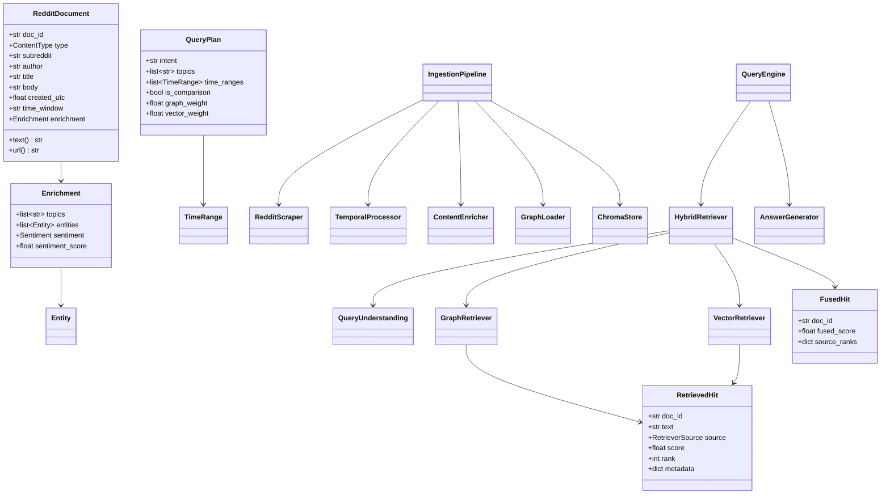

# Architecture — Low-Level Design

This document complements the README with the class diagram, a component
responsibility map, and the key design contracts.

## Class diagram (core types)

## Component responsibilities

| Component | File | Responsibility |
|-----------|------|----------------|
| `Settings` | `config/settings.py` | Single source of truth for all config. |
| `RedditScraper` | `ingestion/reddit_scraper.py` | PRAW scraping; posts + depth-capped comments; ≥3 windows via top(year)+new. |
| `TemporalProcessor` | `ingestion/temporal_processor.py` | Quarter/month bucketing; horizon cut-off. |
| `ContentEnricher` | `llm/extractors.py` | One Gemini call → entities/topics/sentiment (heuristic fallback). |
| `GraphLoader` | `graph/graph_loader.py` | UNWIND-batched MERGE of nodes + temporal edges. |
| `ChromaStore` | `vectorstore/chroma_loader.py` | Chunk → embed → upsert; metadata-filtered query. |
| `QueryUnderstanding` | `llm/query_understanding.py` | Intent/weights (LLM) + time ranges (deterministic). |
| `GraphRetriever` | `retrieval/graph_retriever.py` | Influence / community / topic-entity Cypher strategies. |
| `VectorRetriever` | `retrieval/vector_retriever.py` | Semantic search + chunk→doc max-pool. |
| `reciprocal_rank_fusion` | `retrieval/fusion.py` | Rank-based fusion with provenance. |
| `HybridRetriever` | `retrieval/hybrid_retriever.py` | Concurrent retrieval + fusion + per-period split. |
| `AnswerGenerator` | `llm/answer_generator.py` | Cited synthesis; grouped comparison rendering. |
| `QueryEngine` | `app/engine.py` | Application entry: retrieve → answer → package. |

## Key contracts

1. **Join key.** Graph node ids and vector `doc_id` metadata are identical
   Reddit fullnames. RRF fuses on this key; never on chunk ids.
2. **Score opacity.** RRF ignores raw scores → graph relevance and cosine
   similarity never need to be on the same scale.
3. **Temporal symmetry.** The same `[start, end)` interval is applied to graph
   (`created_utc` predicate) and vector (`where` filter) so the two stores
   always see the same time slice.
4. **Graceful degradation.** Every external dependency (Gemini, Neo4j, Chroma,
   Reddit) is lazily imported and failure-isolated; retrieval never hard-crashes
   on a single retriever failing.
